<!--Header-->
<div align="center">
  
</div>

<div align="center">
  
[](https://git.io/typing-svg)

</div>

---

## 🚀 About Me

<div>

```typescript
const hetkumar = {
  location: "India 🇮🇳",
  currentFocus: "Building scalable full-stack applications with AI integration",
  learning: ["Advanced Flutter Architecture", "AI/ML Integration", "Cloud Native Development"],
  passion: ["Chess Strategy ♟️", "Open Source Contribution", "Innovative Problem Solving"],
  askMeAbout: ["Full Stack Development", "Cross-Platform Mobile Apps", "AI Integration", "DevOps"],
  funFact: "I debug code like I play chess - always thinking 5 moves ahead! 🧠"
};
```

</div>

---

## 🛠️ Tech Arsenal

<div>

### **Languages & Core Technologies**

    

### **Frontend Development**

    

### **Backend & API Development**

    

### **Mobile Development**

  

### **Database Technologies**

   

### **Cloud & DevOps**

   

### **Development Tools**

     

</div>

---

## 🎯 Development Pipeline

```mermaid
flowchart TD
    A[🎨 Frontend Development] --> E[🔗 REST APIs]
    B[📱 Mobile Applications] --> E
    C[🧠 AI Integration] --> E
    D[☁️ Cloud Services] --> E
    E --> F[🚀 Production Deployment]
    F --> G[📊 Monitoring & Analytics]
    
    style A fill:#61DA11
    style B fill:#02569B
    style C fill:#FF6B35
    style D fill:#0089D0
    style E fill:#43853D
    style F fill:#6499E9
    style G fill:#FF6C37
```

<div align="center">



</div>

<div>

### **🔥 Current Focus Areas**

**Full-Stack Web Applications** • React.js & Node.js Architecture  
**Cross-Platform Mobile Development** • Flutter & Native Integration  
**AI-Powered Solutions** • Machine Learning API Integration  
**Cloud-Native Applications** • Azure DevOps & Microservices  

</div>

---

## 📊 GitHub Analytics

<div>

<table>
<tr>
<td>

</td>
<td>

</td>
</tr>
</table>

</div>

<div>
  


</div>

<!-- <div>
  
</div> -->

<div align="center">

### **🏆 GitHub Trophies**


</div>

---

## 🌐 Let's Connect & Collaborate

<div>

### **💼 Professional Network**

<table>
<tr>
<td align="center">
<a href="https://www.linkedin.com/in/hetkumar-prajapati">

<br><sub><b>Professional Updates</b></sub>
</a>
</td>
<td align="center">
<a href="mailto:hetgoraj@gmail.com">

<br><sub><b>Business Inquiries</b></sub>
</a>
</td>
<td align="center">
<a href="https://linktr.ee/hetkumar_prajapati">

<br><sub><b>My Work Showcase</b></sub>
</a>
</td>
</tr>
</table>

### **💬 Let's Chat**

<table>
<tr>
<td align="center">
<a href="https://t.me/hetp44">

<br><sub><b>Quick Messages</b></sub>
</a>
</td>
<td align="center">
<a href="https://discordapp.com/users/hetkumar_prajapati">

<br><sub><b>Tech Discussions</b></sub>
</a>
</td>
<td align="center">
<a href="https://wa.link/k7w517">

<br><sub><b>Direct Contact</b></sub>
</a>
</td>
</tr>
</table>

### **📄 Professional Documents**

<a href="https://drive.google.com/file/d/12HZ3juHJjHLKDXODsdqlXVK3tV_Sprsx/view">

</a>

</div>

---

<div align="center">

### **💡 "The best way to predict the future is to invent it." - Alan Kay**


</div>

<div align="center">

<details>
<summary><b>🎮 Fun Facts & Personal Insights</b></summary>

<br>

<table align="center">
<tr>
<td align="center">♟️</td>
<td><b>Chess Enthusiast</b></td>
<td>Strategic thinking translates to better code architecture</td>
</tr>
<tr>
<td align="center">🚀</td>
<td><b>Code Philosophy</b></td>
<td>Every commit is like a chess move - calculated and purposeful</td>
</tr>
<tr>
<td align="center">🎯</td>
<td><b>Current Goal</b></td>
<td>Building AI systems that can challenge me at chess!</td>
</tr>
<tr>
<td align="center">📚</td>
<td><b>Reading List</b></td>
<td>"Clean Architecture" by Uncle Bob & "Designing Data-Intensive Applications"</td>
</tr>
<tr>
<td align="center">☕</td>
<td><b>Productivity Stack</b></td>
<td>Coffee + Classical Music = Perfect Coding Environment</td>
</tr>
<tr>
<td align="center">🌱</td>
<td><b>Growth Mindset</b></td>
<td>Always learning, always building, always improving</td>
</tr>
</table>

</details>

</div>

<br>

---

<div>

**⭐ If you find my repositories interesting, please star them!**  
**🤝 Open to collaboration on exciting projects and innovative ideas**  
**💼 Available for freelance projects and full-time opportunities**

</div>

<br>

<!-- Footer Wave -->
<div align="center">

</div>
